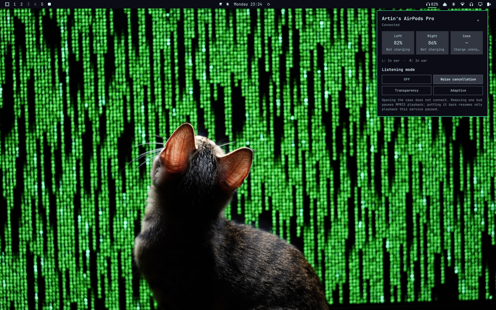
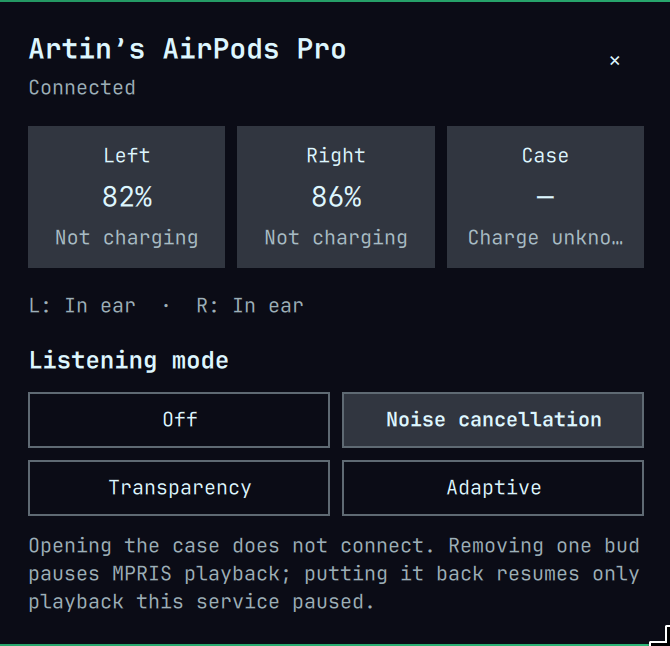

# AirPods In-Ear Guard

An Omarchy bar widget and background service that let your AirPods connect to this computer only when you put one in your ear. Opening the case, or the AirPods sitting nearby, never connects them.

The widget shows battery levels for each bud and the case, and which buds are in your ears. It also switches listening modes and pauses playback when you take one bud out.





> [!IMPORTANT]
> This plugin **blocks your AirPods in BlueZ**. Any connection not started by in-ear detection is cut, including one you start from Omarchy's Bluetooth panel or `bluetoothctl`. To connect them normally again, release them (see [Removal](#removal)).

Status: experimental, version 0.1.0. In-ear connection gating is tested on AirPods Pro (1st generation). Adaptive listening mode is unconfirmed on real hardware.

## How it works

`airpodsd`, a small Rust daemon, runs as a systemd user service:

1. During one-time setup it connects once, while you watch, to obtain the AirPods' proximity keys. It stores them privately.
2. It then keeps the AirPods blocked in BlueZ and listens for their Bluetooth LE advertisements.
3. It unblocks and connects only after a fresh advertisement, verified with those keys as coming from your AirPods, reports a bud in an ear. It allows one attempt per time you put them in. Unknown or contradictory ear states never connect.
4. When both buds are out, or the connection drops, it disconnects and blocks them again.

The Omarchy plugin (`Service.qml`, `Panel.qml`) reads the daemon's state through `airpodsd watch` and sends commands through the same binary.

## Requirements

- Omarchy with the built-in bar (`omarchy.bar`). Replacement bars cannot reach a third-party plugin's service, so the widget would show no data.
- BlueZ, with the AirPods already paired in Omarchy's Bluetooth panel or `bluetoothctl`.
- PipeWire with `pactl` 16 or newer (Arch package: `libpulse`), used to prefer the AAC audio profile.
- To build the daemon: a Rust toolchain (Arch: `rust` or `rustup`), D-Bus headers (Arch: `dbus`; Debian/Ubuntu: `libdbus-1-dev`) and `pkg-config` (Arch: `pkgconf`).

`install.sh` downloads the daemon's Rust dependencies from crates.io, pinned by `backend/Cargo.lock`. It needs no root access and downloads nothing else.

## Installation

1. Add the plugin:

   ```bash
   omarchy plugin add https://github.com/artinlenz/omarchy-airpods
   ```

   `omarchy plugin add` never runs install scripts, so the daemon is not installed yet.

2. Build and start the daemon from the installed plugin folder:

   ```bash
   ~/.config/omarchy/plugins/artinlenz.airpods/install.sh
   ```

   This builds `airpodsd` into `~/.local/bin`, then installs and starts the `omarchy-airpods.service` user unit. If the widget is not on your bar yet, it puts it on the right. It never moves a widget you have already placed.

3. Click the headphones icon in the bar, choose your paired AirPods and press **Connect once & set up**. Keep the case open next to the computer until setup finishes.

From then on, put a bud in your ear to connect.

## Updating

```bash
omarchy plugin update artinlenz.airpods
~/.config/omarchy/plugins/artinlenz.airpods/install.sh
```

`omarchy plugin update` updates only the widget. Re-run `install.sh` to rebuild and restart the daemon. Until you do, the panel shows **Backend outdated: run install.sh**, and its controls are disabled.

## Removal

Run the uninstaller **before** removing the plugin:

```bash
~/.config/omarchy/plugins/artinlenz.airpods/uninstall.sh
omarchy plugin remove artinlenz.airpods
```

`uninstall.sh` first releases the AirPods, restoring their original BlueZ setting. Then it stops and removes the service and the daemon binary. Your Bluetooth pairing is kept. If the release fails, for example because Bluetooth is unavailable, the script stops so it cannot leave the AirPods blocked. Fix Bluetooth and run it again.

### If you removed the plugin first

`omarchy plugin remove` runs no hooks. Within about ten seconds, the daemon notices that the plugin folder is gone, releases the AirPods and stops. If it cannot release them, it keeps retrying. To release them by hand and clean up:

```bash
airpodsd release
systemctl --user disable --now omarchy-airpods.service
rm -f ~/.local/bin/airpodsd ~/.config/systemd/user/omarchy-airpods.service
rm -rf ~/.config/systemd/user/omarchy-airpods.service.d
systemctl --user daemon-reload
```

If `airpodsd` is already gone, unblock the AirPods with their address, which is shown in the panel and stored in `~/.config/omarchy-airpods/config.json`:

```bash
bluetoothctl unblock AA:BB:CC:DD:EE:FF
```

### Releasing without uninstalling

`airpodsd release` returns the AirPods to normal Bluetooth behaviour and forgets that this plugin manages them. To manage them again, run setup from the panel.

## Privacy

- The AirPods' proximity keys are stored in `~/.config/omarchy-airpods/config.json`, mode 0600, in a 0700 directory. They are needed to recognise your AirPods' advertisements and never leave the computer.
- Keys and raw Bluetooth packets are never logged.
- The daemon's control socket lives in `$XDG_RUNTIME_DIR/omarchy-airpods/`, mode 0600. It accepts only connections from your own user.
- Playback resumes only for players the plugin itself paused, and only on the same track.

## Troubleshooting

- `airpodsd status` prints the daemon's current state as JSON.
- `journalctl --user -u omarchy-airpods.service` shows the service log.
- After a failed or interrupted connection, take both buds out and put them back in. The daemon makes one attempt each time you put them in.

## Development

From a development checkout, install only the daemon:

```bash
./install.sh --backend-only
```

A `--backend-only` install does not watch for a plugin folder, so it never releases the AirPods on its own. Run the checks from `backend/`:

```bash
cargo fmt --check
cargo clippy --all-targets -- -D warnings
cargo test --locked
```

## License

- The Omarchy plugin and integration files (`*.qml`, `Model.js`, `install.sh`, `uninstall.sh`, `packaging/`) are MIT licensed. See [LICENSE](LICENSE).
- The `airpodsd` daemon in `backend/` is licensed under GPL-3.0-or-later. See [backend/LICENSE](backend/LICENSE). Its AirPods protocol and key routines are adapted from [LibrePods](https://github.com/kavishdevar/librepods) by Kavish Devar and LibrePods contributors (GPL-3.0-or-later); [backend/NOTICE](backend/NOTICE) lists the sources and changes. This project is not affiliated with LibrePods.

AirPods is a trademark of Apple Inc. This project is not affiliated with or endorsed by Apple Inc.
